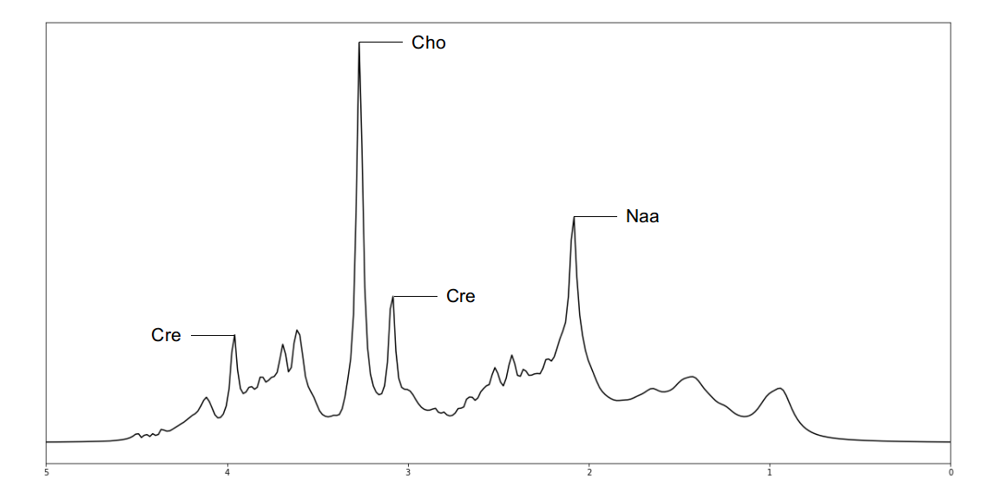

# Improving Model Generalizability for MR Spectroscopy through Generative Adversarial Domain Adaptation 

Using a Generative Adversarial Network (GAN) to decrease the domain shift between real and synthtic Magnetic Resonance Spectroscopy (MRS) samples. Codebase for Bachelor Thesis.

## Introduction:
Alzheimer, Parkinson and brain tumors are considered as some of the most dangerous brain disorders in existence and despite of recent advances in science, researches are not yet able to accurately diagnose or treat these diseases. Additionally to Magnetic Resonance Imaging (MRI), which uses Nuclear Magnetic Resonance (NMR) to create images of the anatomy of e.g. the brain, the so called Magnetic Resonance Spectroscopy (MRS) is the best tool to help with the study of organs. It is a noninvasive *in vivo* technique used to detect the metabolic composition of tissue. Areas infected with tumor cells often show changed quantities of biochemicals when compared to healthy tissue. Therefore, given the normal state of metabolite quantities, it is possible to detect abnormalities in the examined region.


***Figure 1**: MR Spectrum  
Synthetic Long‐TE 1H MR Spectra from the 2016 ISMRM Fitting Challange. The peaks of three metabolites, namely creatine, choline and NAA, are labeled. Note that real spectra usually are more noisy.*

However, not only do the spectral patterns of the various biochemicals overlap, but the extracted spectra also suffer from poor signal-to-noise (SNR) ratio making the task of quantification difficult. Conventional methods for identifying baseline spectra or metabolite concentrations like the \textit{Linear Combination Model} (LCModel) require manual parameter tuning by experts, long computation time and are often error prone for high SNR spectra. 

Motivated by this some researchers began to experiment with utilizing Machine Learning (ML) for interpreting and quantifying the MR spectra. However, they all face the same fundamental problem. To successfully train a robust ML model that can later perform quantification tasks on a spectrum require an extensive amount of labeled training samples. Such a dataset currently does exist since MRS scans on real patients are expensive and as mentioned before, labels are hard to obtain. Moreover, different scanners produce different spectra making is hard for the network to generalize. 

To overcome these obstacles, researchers created a synthetic dataset. Given a set of parameters with a predefined value range, a physics model produces realistic looking MR spectra that are then used to train a neural network or a random forest. However, although the physics model tries its best to generate realistic data, there are some scanner specific nonlinearities that it cannot capture. Therefore, the trained model faces a domain shift from the synthetic spectra to real spectra. This gap has a significant negative impact on the error rate of the network during validation.

We therefore propose to bridge that domain gap with a so called *CycleGAN* which is considered one of the best deep learning tools for domain adaptation. This enables us to learn a mapping function that translates spectra from domain $D_S$ to a domain $D_T$ and \textit{vise versa} without the need of paired samples. Once the CycleGAN is trained, we can thus convert real spectra to the synthetic domain and use e.g. a pretrained random forest for regression.

  
  
*Figure 2: Idea of CycleGAN*  
*Given a sample from domain D_x, a generator network G can transform the sample to a target domain D_y. The second generator F can transform the image back to its original domain. The cycle consistency loss ensures that the structure of the image is preserved.*

## How to Use:
### Prerequesites:
Before you begin, make sure you have a valid python3 installation, and a CUDA-enabled GPU (https://developer.nvidia.com/cuda-gpus).

First, install PyTorch and torchvision. Make sure to install a [version compatible with your GPU's CUDA version](https://pytorch.org/get-started/previous-versions/). E.g. for a conda environment and CUDA 10.1 run:
```sh
conda install pytorch==1.5.1 torchvision==0.6.1 cudatoolkit=10.1 -c pytorch
```

Next, install all the necessary requirements:
```sh
pip install -r requirements.txt
```

### Create a Dataset:
You will need a source dataset and target dataset.
#### DICOM dataset
If your dataset contains DICOM files you first have to transform them into a matlab file. You can either do this on your own or use this project script.
For this you need the multivoxel spectra and a metabolic map to determine the active voxels.
For instance, if your spectra are stored in `**/*_proc.dcm` and metabolic quantities in `**/*_quant_MET` with `MET` being the name of the respective metabolite, you can run:
```sh
python dicom2matlab.py --source-dir [PATH TO DICOM ROOT FOLDER] --save_dir [PATH TO SAVE FOLDER] --file_ext_spectra "_proc.dcm" --file_ext_metabolite "_quant_"
```
See [options](options/README.md) for more information.


#### Matlab dataset
Once both of you datasets are stored in the format of $R^{N\times C \times L}$ you can create the actual dataset.
Run:
```sh
python create_dataset.py --source_path_A [PATH TO SOURCE MATLAB FILE] --A_mat_var_name [NAME OF SOURCE MATLAB VARIABLE] --source_path_B [PATH TO TARGET MATLAB FILE] --B_mat_var_name [NAME OF TARGET MATLAB VARIABLE] --save_dir [PATH TO SAVE FOLDER] --name [NAME OF DATASET]
```
See [options](options/README.md) for more information.

### Training:
If you want to see live updates over visdom, run
```sh
python -m visdom.server
```
to start a visdom server on `http://localhost:8097`. During training, the program will send intermediate results to the server, as well as the updated loss graph.

You can train the model with:
```sh
python train.py --dataroot [PATH TO DATASET] --name [NAME OF EXPERIMENT] --model [GAN MODEL] --batch_size [BATCH SIZE] --n_epochs 15
```
See [options](options/README.md) for more information.


### Validation:
For validation we use a Random Forest. You can pretrain it by running
```sh
python RF_create_baseline.py --source_path [PATH TO SOURCE MATLAB FILE] --source_var_name [NAME OF MATLAB VARIABLE] --target_path [PATH TO TARGET MATLAB FILE] --target_var_name [NAME OF MATLAB VARIABLE]
```
See [options](options/README.md) for more information.

To validate the pre-trained model, run:
```sh
python val.py --dataroot [PATH TO DATASET] --results_dir [PATH TO RESULTS FOLDER] --name [NAME OF EXPERIMENT] --model [GAN MODEL] --val_path [PATH TO RANDOM FOREST] --num_test [NUMBER OF BATCHES]
```

The validation results will be saved as a boxplot at 
See [options](options/README.md) for more information.

### Testing:
To generate a number of fakes by a pretrained network run:
```sh
python test.py --dataroot [PATH TO DATASET] --results_dir [PATH TO RESULTS FOLDER] --name [NAME OF EXPERIMENT] --model [GAN MODEL] --num_test [NUMBER OF BATCHES]
```
See [options](options/README.md) for more information.