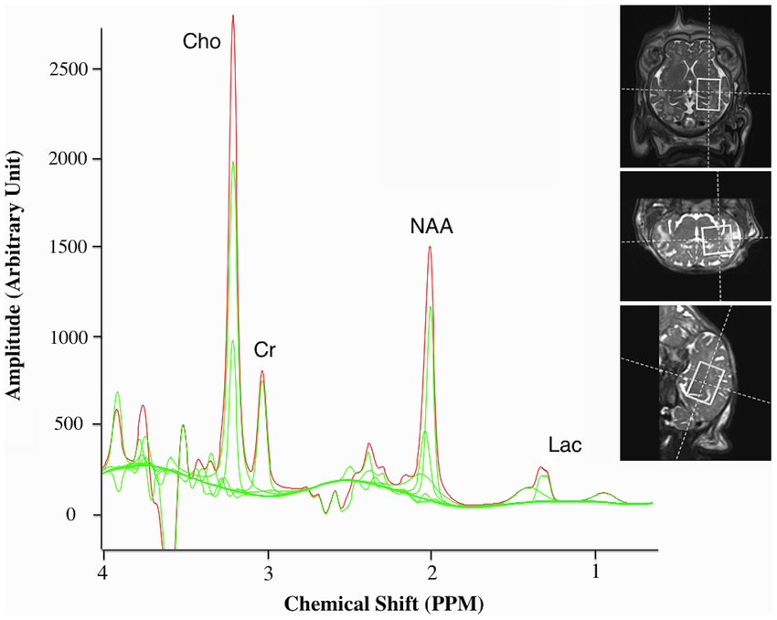
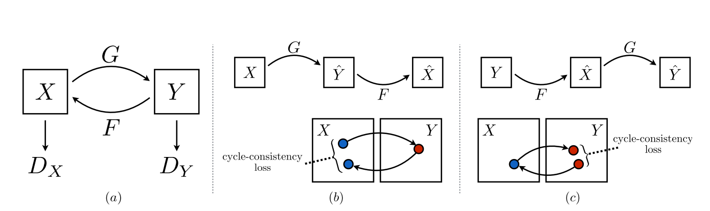
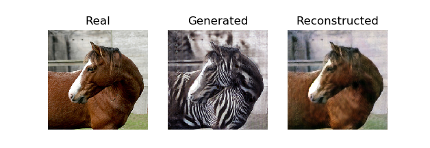

# Improving Generalizability through Generative Adversarial Domain Adaptation for MR Spectroscopy

Using a Generative Adversarial Network (GAN) to decrease the domain shift between real and synthtic Magnetic Resonance Spectroscopy (MRS) samples. Codebase for Bachelor Thesis.

## Introduction:
Magnetic Resonance Spectroscopy (MRS) is an analytical technique to detect metabolic changes in organic tissue. It is used detect abnormalities in the examined region such as a tumor. It complemenets the better known Magnetic Resonance Imaging (MRI) scans to further characterise the tissue.

  
*Figure 1: MRS and MRI sample*  
*The graph shows the concentration of various biochemicals (metabolites) in the examined tissue. The MR scanner only returns the linear combination (red spectrum) of the metabolites' spectra (green spectra). If abnormalities (a tumor for instance), are present, the quantification of the biochemicals change. The MRI scans (three images on the upper right) give imformation about the physical structure of the brain and the tumor. Both methods work complementary.*

Even with todays methods it is still hard to determine certain rules when it comes to regression tasks of MRS samples. The ways of interpretation are too manifold and they are prone to even slight changes of the spectra. Out of this dilemma the idea of using a machine learning approach for spectral quantification was born. However, to train a neural network, millions of labeled sample data would need to be required. The aquisition of such samples is extremly ressourceful and time consuming. Furthermore, ground truth metabolite concentrations are not available for *in vivo* signals, even by using medical experts. Therefore, it might be easier to generate synthetic sample data in order to train the classifier. 
However, when we switch from synthetic data to real data we are facing a domain shift. This is because every MRS scanner produces individual non-linearities, resulting in different looking spectras. The pre-trained network does not yet adapt to this domain shift and thus yields inferior results.
To overcome this domain gap we have two options:

1) We could find a way of improving the quality of the synthetic data to better match the real data. We would then train the network on this now more realistic looking data to decrease the domain difference. However, as stated before, each scanner produces a different distribution, hence it is almost impossible to find a representation that matches well with all scanners. Therefore, one would need to train not only the transforming network specifically for each scanner, but also the regression network, since it has to learn to handle samples from this domain.
2) We could train a network to transform the spectra of a scanner to look more like the clean systhetic data the regression network encountered in training. For this, we would only need to retrain the transforming network for each scanner and can feed the result into the pre-trained regression network. 

This project is an attempt to build a transformer network that can be used for both use cases. For this, we use a version of CycleGAN than uses two  distinct Generator networks to transform signals from domain A to domain B or from B to A, respectively.

  
  
*Figure 2: Idea of CycleGAN*  
*Given a sample from domain D_x, a generator network G can transform the sample to a target domain D_y. The second generator F can transform the image back to its original domain. The cycle consistency loss ensures that the structure of the image is preserved.*

## How to Use:
### Prerequesites:
Before you begin, make sure you have a valid python3 installation, and a CUDA-enabled GPU (https://developer.nvidia.com/cuda-gpus).

First, install PyTorch and torchvision. Make sure to install a [version compatible with your GPU's CUDA version](https://pytorch.org/get-started/previous-versions/). E.g. for a conda environment and CUDA 10.1 run:
```sh
conda install pytorch==1.5.1 torchvision==0.6.1 cudatoolkit=10.1 -c pytorch
```

Next, install all the necessary requirements:
```sh
pip install -r requirements.txt
```

Download a [CycleGAN dataset](#CycleGAN-dataset) (e.g. vangogh2photo):
```sh
bash ./datasets/download_cyclegan_dataset.sh vangogh2photo
```

### Training:
Before starting the training script, run
```sh
python -m visdom.server
```
to start a visdom server on `http://localhost:8097`. During training, the program will send intermediate results to the server, as well as the updated loss graph.

You can train the model with:
```sh
python train.py --dataroot ./datasets/vangogh2photo --name vangogh2photo_cyclegan  --model cycle_gan --no_dropout --batchSize 3 --n_epochs 200 --n_epochs_decay 200 --lambda_A 10.0 --lambda_B 10.0 --lambda_feat 1.0
```
Check the [options folder](./options/README.md) for more information about the run parameters.


### Testing:
To test the pre-trained model, run:
```sh
python test.py --dataroot ./datasets/vangogh2photo --name vangogh2photo_cyclegan --model cycle_gan --phase test --no_dropout --how_many 600
```

The test results will be saved to a html file here: `./results/maps_cyclegan/latest_test/index.html`


## Additional Info
<a name="CycleGAN-dataset"></a>

### DICOM Dataset
If you have a dataset consisting out of DICOM (.dcm) files you first have to convert the spectra into a matlab (.mat) file. For this, follow these steps:

- Make sure to have a licensed matlab installation. 
- Install matlab.engine for your python environment. Validate with running this in python.

```python
import matlab.engine
matlab.engine.start_matlab()
```

- Install the `Image Processing Toolbox` for matlab.

- Let `sourceDir` be the folder containing subfolders with patient data. The relevant samples of patients are in the `folder_ext` folder.
You will need a processed spectra `file_ext_A` that is ready for quantification, as well as a metabolite map (e.g. for NAA) `file_ext_B` to select the activated voxels for evaluation. To store the .mat file in the `saveDir` directory run:
```sh
python preprocess --sourceDir [sourceDir] --saveDir [saveDir] --file_ext_A [file_ext_A] --file_ext_B [file_ext_B] --folder_ext [folder_ext]
```

### CycleGAN dataset
Download the CycleGAN datasets using the following script. 

```sh
bash ./datasets/download_cyclegan_dataset.sh dataset_name
```

Some of the datasets are collected by other researchers. Please cite their papers if you use the data.

- `facades`: 400 images from the [CMP Facades dataset](http://cmp.felk.cvut.cz/~tylecr1/facade/).
- `cityscapes`: 2975 images from the [Cityscapes training set](https://www.cityscapes-dataset.com/).
- `maps`: 1096 training images scraped from Google Maps.
- `horse2zebra`: 939 horse images and 1177 zebra images downloaded from [ImageNet](http://www.image-net.org/) using keywords "wild horse" and "zebra"
- `apple2orange`: 996 apple images and 1020 orange images downloaded from [ImageNet](http://www.image-net.org/) using keywords "apple" and "navel orange".
- `summer2winter_yosemite`: 1273 summer Yosemite images and 854 winter Yosemite images were downloaded using Flickr API. See more details in our paper.
- `monet2photo`, `vangogh2photo`, `ukiyoe2photo`, `cezanne2photo`: The art images were downloaded from [Wikiart](https://www.wikiart.org/). The real photos are downloaded from Flickr using the combination of the tags landscape and landscapephotography. The training set size of each class is Monet:1074, Cezanne:584, Van Gogh:401, Ukiyo-e:1433, Photographs:6853.
- `iphone2dslr_flower`: both classes of images were downlaoded from Flickr. The training set size of each class is iPhone:1813, DSLR:3316. See more details in our paper.

To train a model on your own datasets, you need to create a data folder with two subdirectories `trainA` and `trainB` that contain images from domain A and B. You can test your model on your training set by setting "phase='train'" in `test.lua`. You can also create subdirectories `testA` and `testB` if you have test data.

You should not expect our method to work on just any random combination of input and output datasets (e.g. cats<->keyboards). From our experiments, we find it works better if two datasets share similar visual content. For example, landscape painting<->landscape photographs works much better than portrait painting <-> landscape photographs. zebras<->horses achieves compelling results while cats<->dogs completely fails.
