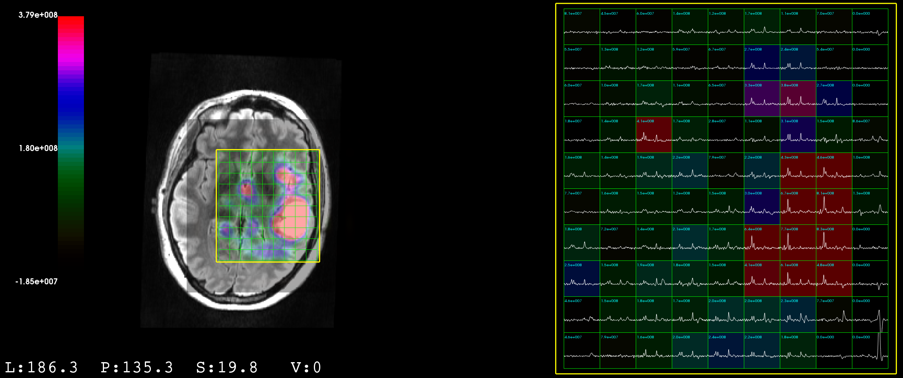

# Improving Model Generalizability for MR Spectroscopy through Generative Adversarial Domain Adaptation 

Quantification of metabolite concentrations in MR spectroscopy is a key task to assist in tumor recognition and treatment. Current methods are time consuming, costly and require manual guidance. The effective use of machine learning methods is slowed by the lack of labeled training data and the domain shifts of spectra across different scanners. In this work we investigate whether unsupervised deep learning methods can be used to aid quantification tasks on MR spectra. We present a novel architecture called REG-CycleGAN that is able to directly train a regression network without the need of labeled source data.

## Introduction:
Alzheimer’s, Parkinson’s and brain tumors are considered some of the most dangerous brain disorders in existence and despite recent advances in science, researchers are not yet able to accurately diagnose or treat these diseases. In addition to Magnetic Resonance Imaging (MRI), which uses Nuclear Magnetic Resonance (NMR) to create images of the anatomy of the brain, the so called Magnetic Resonance Spectroscopy (MRS) is a noninvasive in vivo technique used to evaluate the metabolic composition of
tissue. Areas infected with tumor cells often show different metabolite profiles when compared to healthy tissue. Therefore, given the normal state of metabolite quantities, it is possible to detect abnormalities in the examined region [HB10].


***Figure 1**: MR scan of a tumor patient.* <br>
*The MRI scan on the left shows choline
metabolite concentrations in the region of interest. On the right is a plot of
the respective long echo spectra for each voxel. Data was visualized using SIVIC.*

However, not only do the spectral patterns of the various biochemicals overlap, but the extracted spectra also suffer from poor signal-to-noise (SNR) ratio making the task of quantification difficult. Conventional methods for identifying baseline spectra or metabolite concentrations like the Linear Combination Model (LCModel) require manual parameter tuning by experts, long computation time and are often error prone for low SNR spectra [Das+17]. Current Machine Learning approaches have several limiting factors: Often, there is an insufficient amount of labeled data to extensively train a robust model. Another factor is that each MR scanner produces slightly different
spectra, making it hard to apply a pretrained model from one scanner to samples from
another.

To overcome these obstacles, Das et al. [Das+17] and Hatami et al. [HSR18] consider whether a dataset of synthetically generated spectra can be utilized to train a network. Given a set of parameters with a predefined value range, a physics model produces realistic looking MR spectra that are then used to train a neural network or a random forest. Even though the physics model can generate rather realistic data, there are some scanner specific nonlinearities that cannot be modeled. Because of this, a network pre-trained on synthetic data faces a domain shift when tested on real data. Even small deviations in the spectra’s appearance can have a significant impact on the accuracy of
the network.

This work investigates whether unsupervised domain adaptation methods can be
used to help with bridging the domain shift and propose a novel architecture that
allows for (semi-) unsupervised training of a (deep) neural network for regression
tasks.

## Approach 1: Style Transfer with CycleGAN

In a first approach, we try to address the domain shift by directly briding the domain gap using style transfer. With this pre-processing step we translate a real spectrum into the domain of simulated spectra, i.e. we get rid of all artifacts, line-broadening and noise. After that, the spectra we can directly use the pretrained regression network to infer the metabolic profile.

Since we work with unlabeled data only, we use the CycleGAN architecture that allows for unsupervised style transfer.


***Figure 2: Idea of CycleGAN:***  
*Our CycleGAN setup. Samples  s<sub>S</sub>[l] from the source domain will be translated into the target domain by generator G<sub>A</sub>. Discriminator D<sub>A</sub> will judge the quality of the fake ˆs<sub>T</sub>[l]. The spectrum will then be translated back into the original domain by G<sub>B</sub>. Arec will be used to compute the cycle consistency loss between the source and the reconstructed spectrum. We also train the reverse cycle to improve feature preservation. During validation, B<sub>fake</sub> = ˆs<sub>T</sub>[l] is fed into the pre-trained NT.*


## Approach 2:  Unsupervised Regression with REG-CycleGAN

To overcome the flaws of the vanilla CycleGAN, we present a novel CycleGAN architecture that is specifically optimized for regression tasks. First, let us note that we actually face a very special case of unsupervised translation. We can generate the ground truth synthetic target spectra given the source quantities using our physics model. This means, our CycleGAN does not have to create fakes of the synthetic spectra since we can create them perfectly ourselves. We therefore propose to directly generate quantities from the source spectra. We do that by replacing generator GA with the regression network NT.


***Figure 2: Our proposed REG-CycleGAN setup:***  
*A regression network NT extracts quantities from the spectra. A physics model, PM, builds the ideal version of the spectrum and translates it back into the source domain using generator G. Using the cycle consistency loss in both domains enables us to effectively train N<sub>T</sub> in an unsupervised manner.*

Let us analyze both cycles of the our network in detail to highlight the benefits. We start with the spectra from our source domain. The regression network NT extracts the respective quantities. We omit the discriminator here because we cannot judge the quality of the prediction at this point. Note that we can now easily adapt our method to a semi-supervised setting by comparing some of the predictions with the ground truth training labels. We then modulate the basis spectra with the prediction to form the ideal version of the spectrum. Predicting only the quantities serves as a bottleneck which
takes away the possibility for the generator to store any style information. By explicitly building the ideal spectrum with the quantities we define how the quantities must be interpreted and prevent the generator from using the values as any other information
than peak heights. The ideal spectrum is then translated back into its original domain by generator G. Explicitly building a spectrum also decreases the distance between the source and target domains, simplifying the task for our generator.

For the second cycle, we start with the quantities q<sup>(i)</sup> of the synthetic dataset. We build the ideal spectrum using the physics model. The generator translates the spectrum into the domain D<sub>S</sub>. A discriminator D measures the quality of the produced spectrum. We then use the regression network to reconstruct the quantities. The cycle consistency loss now directly measures the extent to which the features were preserved. Depending on our needs, we can employ an L1, L2, relative error, or any other loss metric.

## How to Use:
### Prerequesites:
Before you begin, make sure you have a valid python3 installation, and a CUDA-enabled GPU (https://developer.nvidia.com/cuda-gpus).

First, install PyTorch and torchvision. Make sure to install a [version compatible with your GPU's CUDA version](https://pytorch.org/get-started/previous-versions/). E.g. for a conda environment and CUDA 10.1 run:
```sh
conda install pytorch==1.5.1 torchvision==0.6.1 cudatoolkit=10.1 -c pytorch
```

Next, install all the necessary requirements:
```sh
pip install -r requirements.txt
```

Now we need to prepare the datasets and create the baelines. For this, take a look at the `create_baseline.py` file and the `prepare.sh` file and set the paths according to your environment. Then run the script:
```sh
sh prepare.sh
```

### Run Experiments
We will now explain how to run the experiments in the thesis. To run your own experiments, please have a look at the respective code files or contact the author.

#### Training

You can train the CycleGAN on the UCSF dataset by running:
```sh
python train.py --dataroot {PATH TO PROJECT}/datasets/ucsf --name CycleGAN-WGP_ucsf --model cycleGAN_W --val_path {PATH TO PRE-TRAINED N_T} --gpu_ids 0 --n_critic 5 --shuffle --gan_mode wasserstein --save_epoch_freq 100 --quiet --roi 361,713 --lambda_identity 0.5 --cbamG
```

To train the REG-CycleGAN on the UCSF dataset run:
```sh
python raytune.py --dataroot {PATH TO PROJECT}/datasets/ucsf --name REG-CycleGAN_ucsf_medium --model cycleGAN_W_REG --gpu_ids 0,1 --TTUR --n_critic 5 --gan_mode wasserstein --save_epoch_freq 100 --quiet --roi 361,713 --n_layers_D 3 --display_freq 2500 --cbamG
```

#### Validation

```sh
python val.py --dataroot {PATH TO PROJECT}/datasets/ucsf --model_path {PATH TO CHECKPOINT} --name {NAME OF EXPERIMENT} --gpu_ids 0 --quiet
```